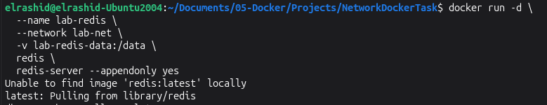
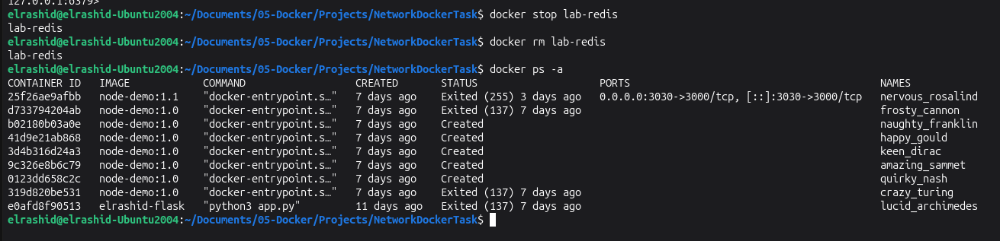
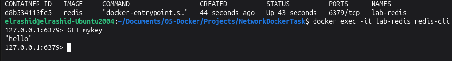
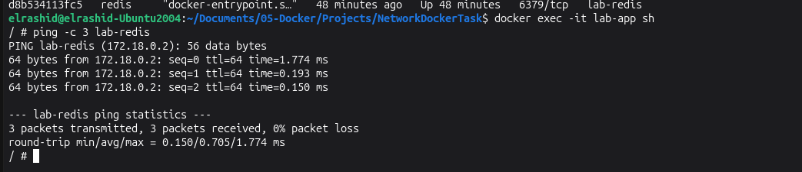

# Docker Redis Persistence and Networking Lab

## Overview

This lab demonstrates three important Docker concepts:

1. Custom Docker networks
2. Persistent data using named volumes
3. Container-to-container communication using Docker DNS

The lab uses:

- Ubuntu Linux
- Docker
- Redis
- Alpine Linux
- Git

---

## Architecture

```text
                    Docker Host
                         |
                     lab-net
                    /       \
                   /         \
                  /           \
          lab-app             lab-redis
          Alpine                Redis
                                 |
                               /data
                                 |
                         lab-redis-data
                          Named Volume


## Project Structure

```text
NetworkDockerTask/
├── README.md
└── screenshots/
    ├── 01-network.png
    ├── 02-volume.png
    ├── 03-RunnigRedisContainerpng
    ├── 04-unnigRedisContainer.png
    ├── 05-VerifiedRediscontainer
    ├── 06-SetKey
    ├── 07-GetKey  
    ├── 08-remove-container.png
    ├── 09-data-survived.png
    └── 10-DNS-testing.png
```

## Step 1 — Create the custom network


```bash
     docker network create lab-net
     docker network ls
```


## Step 2 — Create the named volume
 Run:
 
```bash
docker volume create lab-redis-data
```
Verify:

```bash
    docker volume ls
```

## Step 3 — Run the Redis container

Now run Redis.

Use this command:
```bash
docker run -d \
  --name lab-redis \
  --network lab-net \
  -v lab-redis-data:/data \
  redis \
  redis-server --appendonly yes
```
Verify :
```bash
docker ps
```
or :
```bash 
   docker logs lab-redis
```


## Step 4 — Store data in Redis

The task says:

Exec into lab-redis and use redis-cli to SET mykey "hello".
 Run:
 
```bash
      docker exec -it lab-redis redis-cli

```
You should enter the Redis CLI::

```redis
 SET mykey "hello
    
```
You should get:
```
      "Hello"
```

Exit Redis:
```
   exit
```

## Step 5 — Stop and remove the Redis container
This is an important part of the exercise.

First stop it:

 
```bash
 docker stop lab-redis
```
Then remove it::

```bash
docker rm lab-redis
    
```


Verify:

```bash
   docker ps -a 
```
lab-redis should no longer appear.


## Step 9. Make sure the volume still exists
  This is the whole point of the exercise.
 Run:
 
```bash
docker volume ls
```

You should still see:

```bash
 DRIVER    VOLUME NAME
local     lab-redis-data   
```
## Step 6 — Create a brand-new Redis container

Now recreate the container using the same volume.
 Run:
 
```bash
        docker run -d \
  --name lab-redis \
  --network lab-net \
  -v lab-redis-data:/data \
  redis \
  redis-server --appendonly yes
```
Verify:

```bash
    lab-redis
```
You should see:

```bash
    lab-redis
```

## Step 7 — Prove the data survived
Now execute Redis CLI again:
 
```bash
docker exec -it lab-redis redis-cli

```
Then:

```redis
GET mykey
    
```
 You should get::
 ```
       "hello"
 ```
  This proves that the data survived container deletion.
 ```
 
 

## Step 8 — Create the second container
 Now we need:
 ```
 lab-ap
 ```
  on the same network:
 ```
 lab-net
 ```
 We'll use Alpine.
 Run:
 
```bash
  docker run -dit \
  --name lab-app \
  --network lab-net \
  alpine
```
Verify:

```bash
  docker ps  
```
You should have:

```
   lab-redis
   lab-app
```
## Step 9 Test DNS between the containers
 Now enter lab-app:
 
```bash
         docker exec -it lab-app sh
```
Now try:

```bash
    ping -c 3 lab-redis
```
 

